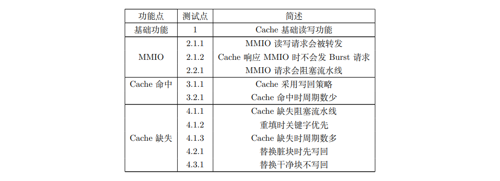

# 新手任务 2 - Toffee

```bash
make init
make test
make wave
make clean
make firefox
```

> $ make clean && make init && clear && make test

## 1. 用 toffee-test 管理测试用例

> > 已完成

## 2. 使用 Bundle 封装 DUT

> > 已完成

## 3. 使用 Agent 进一步封装

> 思考：回顾你在 Bundle 和 Agent 练习中实现的 enqueue 和 dequeue 方法。将这些操作逻辑放在 Bundle 层实现（作为 Bundle 的方法），然后在 Agent 层简单调用 @driver_method 包装一下是更合适，还是直接在 Agent 的 @driver_method 中编写完整的信号操作逻辑更合适？或者有其他更好的方式？为什么？（提示：考虑代码复用、职责分离、抽象层次）
>
> > 操作逻辑位于 Bundle层 合适，Agent层 只需要调用 Bundle 层的方法即可。毕竟，各层有各层的抽象，直接写穿底层会导致高耦合以及代码复用率低，Debug时候给自己白增加工作量。

> 思考：当我们把不同功能的输入封装为多个驱动函数之后，似乎每次只能串行一个驱动函数，对于多个功能同时输入的情况该怎么办呢？请阅读 toffee 文档中如何同时调用多个驱动函数部分，探索Executor的基本用法，然后在 Agent 中完成对同时进行读写操作的封装。（提示：文档中Env不影响理解，后续会进行介绍）。
>
> > 已完成

## 4. 收集功能覆盖率

> > 覆盖率报告
> >
> > 
> >
> > 生成的位置位于：`fifo_test/reports/sync_fifo_report.html`

## 5. 编写参考模型并打包验证环境

> > 已完成
