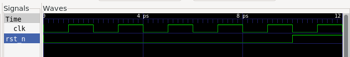

# 新手任务 1 - Picker

```bash
make init
make test
make unit
make wave
make clean
```


## 1. DUT 类的创建和初始化

> 在默认的写模式下，rst_n 的拉高是在是在什么时候生效的？
> > 默认波形图：
> > 
> > 
> >
> > 时钟在上升沿

> 把rst_n的写模式修改为立即模式Imme，再重新观察rst_n 的拉高是在是在什么时候生效的？跟默认情况下的波形做一个比对。
> > 立即模式波形图：
> > 
> > 
> >
> > 在下降沿就写入了

> 思考：在对模块进行初始化时，仅仅是对rst_n进行赋值就足够了吗？还需要注意什么？
> > 还需视情况将部分输入也合理初始化，比如测试总线的时候可以先将总线初始化为z等等

## 2. 编写复位测试

> > 已完成

## 3. 编写冒烟测试

> > 已完成
